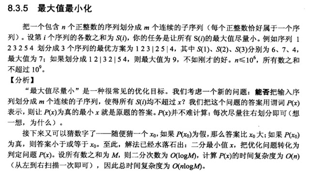

# 437. Copy Book 书籍复印

[https://www.lintcode.com/problem/copy-books/description](https://www.lintcode.com/problem/copy-books/description)\
\
\
Given `n` books and the `i-th` book has `pages[i]` pages. There are `k` persons to copy these books.

These books list in a row and each person can claim a continous range of books. For example, one copier can copy the books from `i-th` to `j-th` continously, but he can not copy the 1st book, 2nd book and 4th book (without 3rd book).

They start copying books at the same time and they all cost 1 minute to copy 1 page of a book. What's the best strategy to assign books so that the slowest copier can finish at earliest time?

Return the shortest time that the slowest copier spends.


&#x20;**Example 1:**

```
Input: pages = [3, 2, 4], k = 2
Output: 5
Explanation: 
    First person spends 5 minutes to copy book 1 and book 2.
    Second person spends 4 minutes to copy book 3.
```

```java
public class Solution {
    /**
     * @param pages: an array of integers
     * @param k: An integer
     * @return: an integer
     */
    public int copyBooks(int[] pages, int k) {
        // write your code here
        
        
        int left = 0; int right = 0;
        for(int i = 0; i < pages.length; i++){
            right += pages[i];
        }
        
        while(left + 1 < right){
            int mid = left + (right - left) / 2;
            if(isValid(pages, k, mid)){
                right = mid;
            }
            else 
                left = mid;
            
        }
        
        if(isValid(pages, k, left)) return left;
        else return right;
    }
    
    public boolean isValid(int[] pages, int people, int time){
        int sum_page = 0;
        int count_people = 1;
        for(int i = 0; i < pages.length; i++){
           if(pages[i] > time) return false;
           if(pages[i] + sum_page > time){
               count_people++;
               sum_page = pages[i];
           }
           else{
               sum_page += pages[i];
           }
        }
        
        return count_people <= people;
    }
    
}
```


